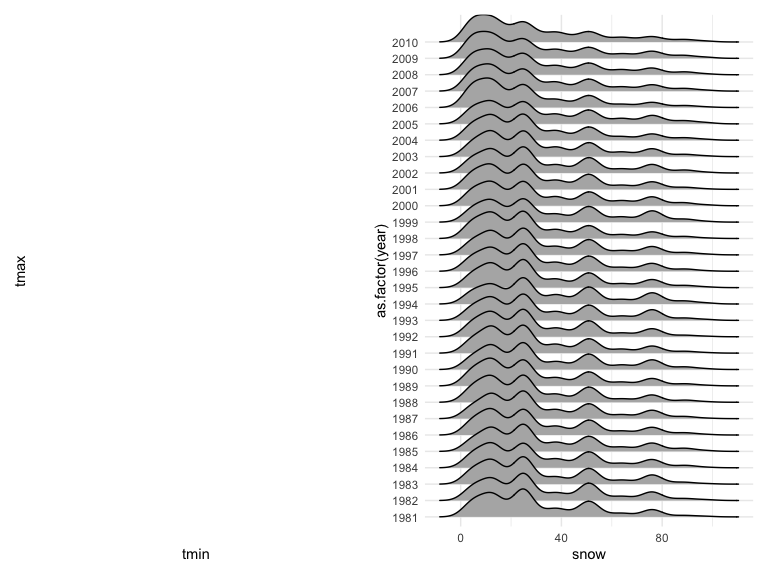
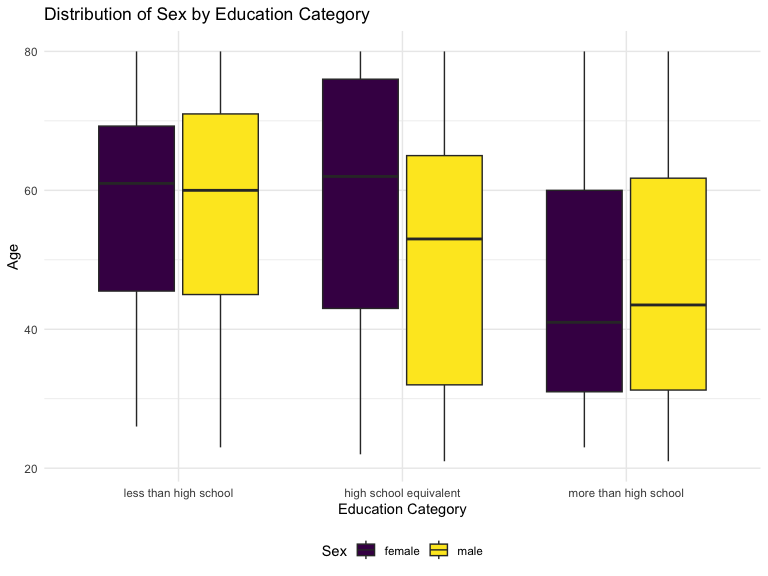
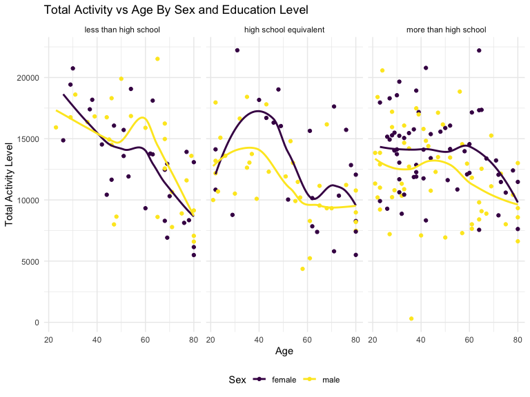
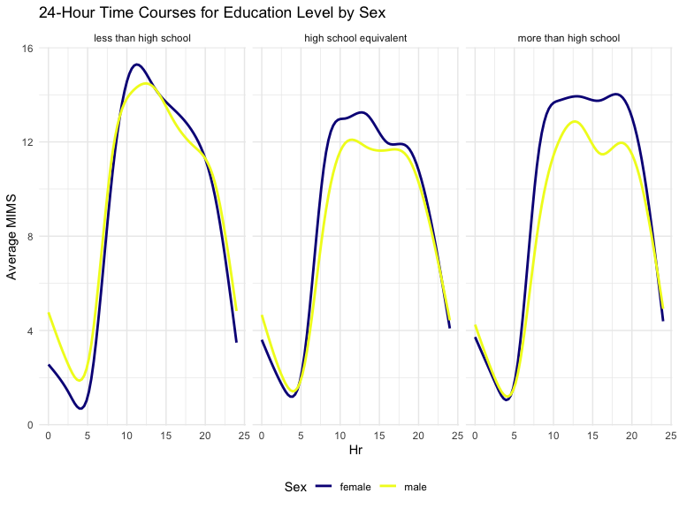
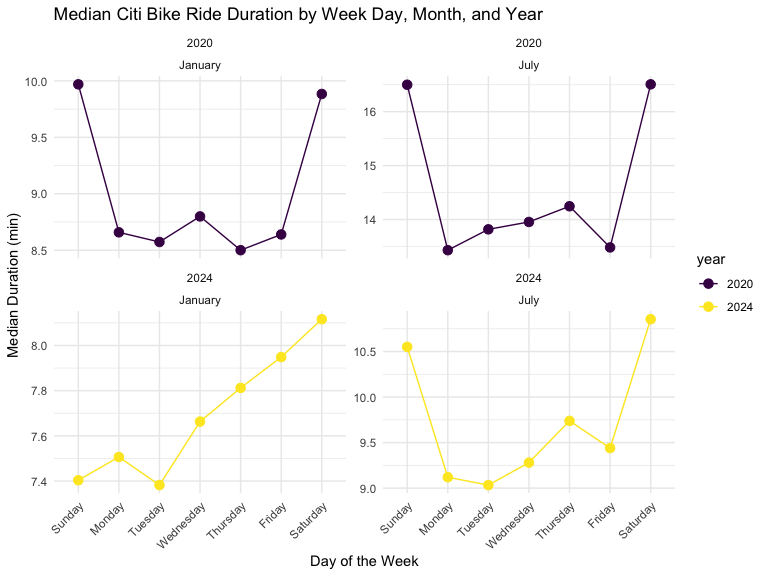
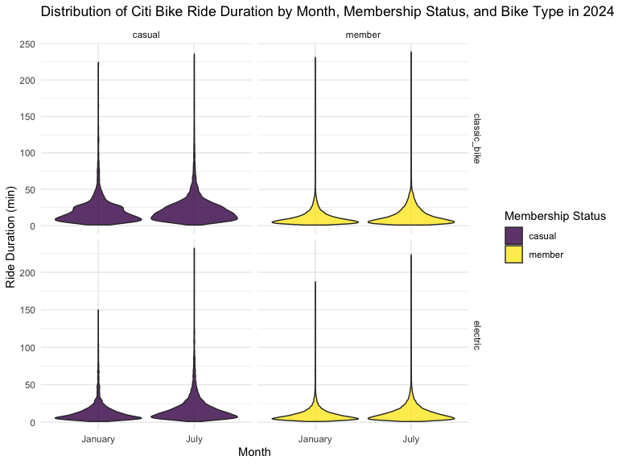

p8105_hw3_akg2197
================
Annie Gorman
2024-10-10

## Loading libraries

This is problem 1 - the code is used from the solutions and the figures
are examined for comprehension: \## Problem 1 Reading in the data:

``` r
data("ny_noaa")
```

#### Answer questions about the data

The dataset contains 2595176 rows and 7 columns. Variables in this
dataset are weather station identification, date of observation (tenths
of mm), snowfall (mm), snow depth (mm), and min/max temperature (tenths
of degrees C).

Cleaning the data:

``` r
ny_noaa %>% 
  count(snow) %>%
  arrange(desc(n))
```

    ## # A tibble: 282 × 2
    ##     snow       n
    ##    <int>   <int>
    ##  1     0 2008508
    ##  2    NA  381221
    ##  3    25   31022
    ##  4    13   23095
    ##  5    51   18274
    ##  6    76   10173
    ##  7     8    9962
    ##  8     5    9748
    ##  9    38    9197
    ## 10     3    8790
    ## # ℹ 272 more rows

``` r
ny_noaa = 
  ny_noaa %>% 
  separate(date, into = c("year", "month", "day"), convert = TRUE) %>% 
  mutate(
    tmax = as.numeric(tmax),
    tmin = as.numeric(tmin))
```

0 is the most commonly observed value for snowfall. NY does not get any
snow (0) a majority of days, resulting in this common value. Just behind
0 is `NA`, or missing. 13, 25, and 51 are other common values.

``` r
ny_noaa %>% 
  group_by(id, year, month) %>% 
  filter(month %in% c(1, 7)) %>% 
  summarize(mean_tmax = mean(tmax, na.rm = TRUE, color = id)) %>% 
  ggplot(aes(x = year, y = mean_tmax, group = id)) + geom_point() + geom_path() +
  facet_grid(~month) +
  labs(title = "Mean monthly temperature for each station across years for January and July")
```

    ## `summarise()` has grouped output by 'id', 'year'. You can override using the
    ## `.groups` argument.


The above plot is a two-panel plot showing average max temperature in
January and in July in each station across years. January has a lower
mean temperature than July at all stations throughout all years.

``` r
hex = 
  ny_noaa %>% 
  ggplot(aes(x = tmin, y = tmax)) + 
  geom_hex()

ridge = 
  ny_noaa %>% 
  filter(snow < 100, snow > 0) %>%
  ggplot(aes(x = snow, y = as.factor(year))) + 
  geom_density_ridges()

hex + ridge
```

    ## Picking joint bandwidth of 3.76


The above hex plot shows that most data is located around the center of
the distribution. Strangely, tmax is occasionally lower than tmin.

The ridge plot shows the density of snowfall in a year. Most stations
have snowfall between 0 and 35 mm per year, but others experience
greater snowfall (almost 80 mm).

## Problem 2

Loading the demographic data:

``` r
demographic_data = read_csv("nhanes_covar.csv", skip = 4) |>
  janitor::clean_names() |>
  drop_na() |>
  mutate (
    sex = case_when(sex==1~"male", sex==2 ~ "female"), 
    education = case_when(
      education==1 ~ "less than high school",
      education==2 ~ "high school equivalent",
      education==3 ~ "more than high school"),
  education = fct_relevel(education,"less than high school", "high school equivalent", "more than high school" )) 
```

    ## Rows: 250 Columns: 5
    ## ── Column specification ────────────────────────────────────────────────────────
    ## Delimiter: ","
    ## dbl (5): SEQN, sex, age, BMI, education
    ## 
    ## ℹ Use `spec()` to retrieve the full column specification for this data.
    ## ℹ Specify the column types or set `show_col_types = FALSE` to quiet this message.

``` r
accelerometer_data = read_csv("nhanes_accel.csv") |>
  janitor::clean_names() |>
  pivot_longer(names_to = "minute", values_to = "MIMS", starts_with("min"), names_prefix = "min") |>
  mutate(minute = as.numeric(minute))
```

    ## Rows: 250 Columns: 1441
    ## ── Column specification ────────────────────────────────────────────────────────
    ## Delimiter: ","
    ## dbl (1441): SEQN, min1, min2, min3, min4, min5, min6, min7, min8, min9, min1...
    ## 
    ## ℹ Use `spec()` to retrieve the full column specification for this data.
    ## ℹ Specify the column types or set `show_col_types = FALSE` to quiet this message.

``` r
merged_nhanes = demographic_data |>
  left_join(accelerometer_data, by= join_by(seqn)) |>
  relocate(seqn, sex, age, bmi, education) |>
  filter(age>20)
```

We can use this code chunk to examine our datasets:

``` r
demographic_data
```

    ## # A tibble: 229 × 5
    ##     seqn sex      age   bmi education             
    ##    <dbl> <chr>  <dbl> <dbl> <fct>                 
    ##  1 62161 male      22  23.3 high school equivalent
    ##  2 62164 female    44  23.2 more than high school 
    ##  3 62169 male      21  20.1 high school equivalent
    ##  4 62174 male      80  33.9 more than high school 
    ##  5 62177 male      51  20.1 high school equivalent
    ##  6 62178 male      80  28.5 high school equivalent
    ##  7 62180 male      35  27.9 more than high school 
    ##  8 62184 male      26  22.1 high school equivalent
    ##  9 62189 female    30  22.4 more than high school 
    ## 10 62199 male      57  28   more than high school 
    ## # ℹ 219 more rows

``` r
view(demographic_data)

accelerometer_data
```

    ## # A tibble: 360,000 × 3
    ##     seqn minute  MIMS
    ##    <dbl>  <dbl> <dbl>
    ##  1 62161      1 1.11 
    ##  2 62161      2 3.12 
    ##  3 62161      3 1.47 
    ##  4 62161      4 0.938
    ##  5 62161      5 1.60 
    ##  6 62161      6 0.145
    ##  7 62161      7 2.10 
    ##  8 62161      8 0.509
    ##  9 62161      9 1.63 
    ## 10 62161     10 1.20 
    ## # ℹ 359,990 more rows

``` r
view(accelerometer_data)
```

The data are cleaned and we can now move on to visualizing the data.

#### We will create a table of men and women in each education category:

``` r
education_table <- demographic_data |>
  count(education, sex) |>
  pivot_wider(names_from = sex, values_from = n, values_fill = 0) |>
  rename ("Level of Education" = education)
knitr::kable(education_table, format = "markdown", caption = "Age Distributions for Men and Women in Each Education Category")
```

| Level of Education     | female | male |
|:-----------------------|-------:|-----:|
| less than high school  |     28 |   27 |
| high school equivalent |     23 |   36 |
| more than high school  |     59 |   56 |

Age Distributions for Men and Women in Each Education Category

In this table, we can see that for the “less than high school” education
category, 28 females and 27 males were documented. For “high school
equivalent,” 23 females and 36 males were recorded. “More than high
school” was the most common education status, with 59 females and 56
males.

#### We can also visualize this data of the age distributions for men and women in each education category:

``` r
  ggplot(merged_nhanes, aes(x = education, y = age, fill = sex)) + 
  geom_boxplot() + 
  labs(
    title = "Distribution of Sex by Education Category", 
    x = "Education Category",
    y = "Age",
    fill = "Sex"
  ) 
```


We can see from this boxplot that for those with less than a high school
education, age is less distributed and has a higher minimum for both men
and women than in other education categories. For a high school
equivalent education, females have a notably higher mean age than males.
This distribution also has a greater spread than the other education
categories. Both males and females who have completed more than high
school appear to have lower mean ages than the other education levels.

#### Visualization of total activity variable for each participant:

``` r
merged_nhanes |>
  group_by(seqn, age, education, sex) |>
  summarize(total_act=sum(MIMS)) |>
  ggplot(aes(x = age, y = total_act, color = sex)) + 
  geom_point() +
  facet_grid(. ~ education) +
  labs (
    title = "Total Activity vs Age By Sex and Education Level",
    x = "Age", 
    y = "Total Activity Level",
    color = "Sex"
  ) +
  geom_smooth(se = FALSE) 
```

    ## `summarise()` has grouped output by 'seqn', 'age', 'education'. You can
    ## override using the `.groups` argument.
    ## `geom_smooth()` using method = 'loess' and formula = 'y ~ x'


From this plot, we can see that for all levels of education, total
activity decreases with increasing age for both males and females. The
general trend is consistent across all education levels, with a sharper
increase in total activity by age among those with less than a high
school education. For those who have completed more than high school,
the decline in activity with age is flatter.

#### Now, we will make a three-panel plot that shows the 24-hour activity time courses for each education level and use color to indicate sex:

``` r
daily_activity <- merged_nhanes |>
  mutate(hour = (minute - 1) / 60) |>
  group_by(seqn, hour, sex, education) |>
  summarise(MIMS = mean(MIMS, na.rm = TRUE), .groups = 'drop')

ggplot(daily_activity, aes(x = hour, y = MIMS, color = sex)) +
  geom_smooth(se = FALSE) +
  facet_grid(. ~ education) +
  labs(
    title = "24-Hour Time Courses for Education Level by Sex",
    x = "Hr",
    y = "Average MIMS",
    color = "Sex"
  ) +
  theme_minimal() +
  scale_color_viridis_d(option = "plasma") +
  theme(legend.position = "bottom")
```

    ## `geom_smooth()` using method = 'gam' and formula = 'y ~ s(x, bs = "cs")'


I created this plot by converting minutes into hours so that we can look
at activity time courses in the form of hours. The 24-hour time courses
for each level and for both sexes appear to follow a similar trend:
activity is lower in the early morning hours (middle of the night), and
increases as the day approaches midday. Once hour hits about 15, we can
see activity declining, and continues to sharply decline into the late
hours (corresponding with late night/early morning).

## Question 3

#### Importing, cleaning, and tidying the Citi Bikes data for both Jan and July 2020 and Jan and July 2024:

``` r
jan2020 = read_csv("citibike/Jan2020Citi.csv.zip") |> 
  janitor::clean_names() |>
  rename(
    ride_type = rideable_type, 
    start_station = start_station_name,
    end_station = end_station_name
  ) |>
  mutate(
    ride_type = str_replace(ride_type, "classic bike", "classic"),
    ride_type = str_replace(ride_type, "electric_bike", "electric"), month = "jan2020"
  )
```

    ## Rows: 12420 Columns: 7
    ## ── Column specification ────────────────────────────────────────────────────────
    ## Delimiter: ","
    ## chr (6): ride_id, rideable_type, weekdays, start_station_name, end_station_n...
    ## dbl (1): duration
    ## 
    ## ℹ Use `spec()` to retrieve the full column specification for this data.
    ## ℹ Specify the column types or set `show_col_types = FALSE` to quiet this message.

``` r
july2020 = read_csv("citibike/July 2020 Citi.csv.zip") |>
 janitor::clean_names() |>
  rename(
    ride_type = rideable_type, 
    start_station = start_station_name,
    end_station = end_station_name
  ) |>
  mutate(
    ride_type = str_replace(ride_type, "classic bike", "classic"),
    ride_type = str_replace(ride_type, "electric_bike", "electric"), month = "july2020"
  )
```

    ## Rows: 21048 Columns: 7
    ## ── Column specification ────────────────────────────────────────────────────────
    ## Delimiter: ","
    ## chr (6): ride_id, rideable_type, weekdays, start_station_name, end_station_n...
    ## dbl (1): duration
    ## 
    ## ℹ Use `spec()` to retrieve the full column specification for this data.
    ## ℹ Specify the column types or set `show_col_types = FALSE` to quiet this message.

``` r
jan2024 = read_csv("citibike/Jan 2024 Citi.csv.zip") |>
 janitor::clean_names() |>
  rename(
    ride_type = rideable_type, 
    start_station = start_station_name,
    end_station = end_station_name
  ) |>
  mutate(
    ride_type = str_replace(ride_type, "classic bike", "classic"),
    ride_type = str_replace(ride_type, "electric_bike", "electric"), month = "jan2024"
  )
```

    ## Rows: 18861 Columns: 7
    ## ── Column specification ────────────────────────────────────────────────────────
    ## Delimiter: ","
    ## chr (6): ride_id, rideable_type, weekdays, start_station_name, end_station_n...
    ## dbl (1): duration
    ## 
    ## ℹ Use `spec()` to retrieve the full column specification for this data.
    ## ℹ Specify the column types or set `show_col_types = FALSE` to quiet this message.

``` r
july2024 = read_csv("citibike/July 2024 Citi.csv.zip") |>
 janitor::clean_names() |>
  rename(
    ride_type = rideable_type, 
    start_station = start_station_name,
    end_station = end_station_name
  ) |>
  mutate(
    ride_type = str_replace(ride_type, "classic bike", "classic"),
    ride_type = str_replace(ride_type, "electric_bike", "electric"), month = "july2024"
  )
```

    ## Rows: 47156 Columns: 7
    ## ── Column specification ────────────────────────────────────────────────────────
    ## Delimiter: ","
    ## chr (6): ride_id, rideable_type, weekdays, start_station_name, end_station_n...
    ## dbl (1): duration
    ## 
    ## ℹ Use `spec()` to retrieve the full column specification for this data.
    ## ℹ Specify the column types or set `show_col_types = FALSE` to quiet this message.

We will bind the rows to combine these datasets, mutating the month and
year variables:

``` r
combined_citi = bind_rows(
  jan2020 |> 
    mutate(month="January", year="2020"),
  july2020 |>
    mutate(month="July", year="2020"),
  jan2024 |>
    mutate(month="January", year="2024"),
  july2024 |>
    mutate(month="July", year="2024")
)
```

The resulting dataset from this cleaning process includes months January
and July of 2020 and 2024. We have renamed some of the variables, like
electric_bike and classic_bike, to electric and classic, respectively,
for conciseness. The combined citi bike dataset includes variables ride
ID, ride type, weekdays, duration, start station, end station, member
vs. casual, and month. Combining all years and months into one dataset
will help with our visualization code and make it more streamlined.

Now that the data are tidy, we can move onto visualization \####
Reader-friendly table showing the total number of rides in each
combination of year and month separating casual riders and Citi Bike
members:

``` r
combined_citi |>
  mutate(member_casual = recode(member_casual,
                                 "member" = "Citi Bike Member",
                                 "casual" = "Casual Rider"),
         Timeframe = paste(month, year)) |>
  group_by(member_casual, Timeframe) |>
  summarise(total_obs = n(), .groups = 'drop') |>
  pivot_wider(
    names_from = member_casual,
    values_from = total_obs) |> 
  knitr::kable()
```

| Timeframe    | Casual Rider | Citi Bike Member |
|:-------------|-------------:|-----------------:|
| January 2020 |          984 |            11436 |
| January 2024 |         2108 |            16753 |
| July 2020    |         5637 |            15411 |
| July 2024    |        10894 |            36262 |

This table illustrates the month and year (either January or July, 2020
or 2024), and the type of rider, which is either a casual Citi Bike
rider or a member of Citi Bike. The total rides for each month and year
as well as type of rider is shown. Since 2020, the number of both casual
riders and Citi Bike members have greatly increased. Additionally, there
have been more rides in July than January in 2020 and 2024 for both
casual riders and Citi Bike members.

#### 5 most popular starting stations for July 2024, including the number of rides originating from these stations

``` r
popular_stations <- july2024 |>
  group_by(start_station) |>
  summarize(origin_count = n()) |>
  arrange(desc(origin_count)) |>
  slice_head(n=5)
knitr::kable(popular_stations,
             caption = "5 most popular starting stations for July 2024",
              col.names = c("Origin Station", "Number of Rides"),
              align = "c")
```

|      Origin Station      | Number of Rides |
|:------------------------:|:---------------:|
| Pier 61 at Chelsea Piers |       163       |
| University Pl & E 14 St  |       155       |
|     W 21 St & 6 Ave      |       152       |
|  West St & Chambers St   |       150       |
|     W 31 St & 7 Ave      |       146       |

5 most popular starting stations for July 2024

#### Plot to investigate the effects of day of the week, month, and year on median ride duration

Here, we will generate some summary data from the combined Citi Bike
dataframe. We will look at week, month, and year.

``` r
summary_data <- combined_citi |>
  mutate(weekdays = factor(weekdays,
                           levels = c("Sunday", "Monday", "Tuesday", "Wednesday", "Thursday", "Friday", "Saturday"))) |>
  group_by(year, month, weekdays) |>
  summarise(median_duration = median(duration, na.rm = TRUE), .groups = 'drop')

ggplot(summary_data, aes(x = weekdays, y = median_duration, group = year, color = year)) + 
  geom_line() + 
  geom_point(size = 3) +
  facet_wrap(~ year + month, scales = "free_y") +
  labs(
    title = "Median Citi Bike Ride Duration by Week Day, Month, and Year", 
    x = "Day of the Week",
    y = "Median Duration (min)",
  ) +
  scale_color_viridis_d() +
  theme_minimal() +
  theme(axis.text.x = element_text(angle = 45, hjust = 1))
```


This plot shows the median duration of Citi Bike rides in January and
July 2020 and 2024. We can see that median ride durations are highest on
weekends (Saturday and Sunday) in both January and July 2020, as well as
July 2024. However, In January 2024, median durations peak on Saturday
and are very low on Sunday, unlike the other months and years. Ride
durations appear to be at the lowest at the beginning (~Monday) and end
(~Friday) of the week, other than for Jan 2024, which shows an increase
in duration beginning following Tuesday.

#### Figure that shows the impact of month, membership status, and bike type on the distribution of ride duration

``` r
ggplot(combined_citi, aes(x = month, y = duration, fill = member_casual)) + 
  geom_violin(trim = TRUE, scale = "width", alpha = 0.8) + 
  facet_grid(ride_type ~ member_casual, scales = "free_y") + 
  labs(
    title = "Distribution of Citi Bike Ride Duration by Month, Membership Status, and Bike Type in 2024",
    x = "Month",
    y = "Ride Duration (min)",
    fill = "Membership Status"
  ) + 
  scale_x_discrete(labels = c("jan2024" = "Jan", "july2024" = "Jul")) + 
  scale_fill_viridis_d() + 
  theme_minimal() 
```


From this violin plot, we can see that the majority of rides for both
electric and classic bikes in January and July 2024 for both casual
riders and Citi Bikes members are low. The vast majority of rides are
under 25 minutes, with some very rarely approaching 100-200 minutes.
Additionally, it appears that ride durations are longer in July than
January for both casual and member riders, and on both classic and
electric bikes.
