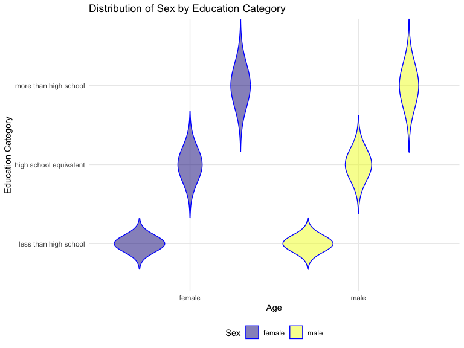

p8105_hw3_akg2197
================
Annie Gorman
2024-10-10

## Loading libraries

## Problem 1

``` r
library(p8105.datasets)
data("ny_noaa")
```

## Problem 2

Loading the demographic data:

``` r
demographic_data = read_csv("nhanes_covar.csv", skip = 4) |>
  janitor::clean_names() |>
  drop_na() |>
  mutate (
    sex = case_when(sex==1~"male", sex==2 ~ "female"), 
    education = case_when(
      education==1 ~ "less than high school",
      education==2 ~ "high school equivalent",
      education==3 ~ "more than high school"),
  education = fct_relevel(education,"less than high school", "high school equivalent", "more than high school" )) 
```

    ## Rows: 250 Columns: 5
    ## ── Column specification ────────────────────────────────────────────────────────
    ## Delimiter: ","
    ## dbl (5): SEQN, sex, age, BMI, education
    ## 
    ## ℹ Use `spec()` to retrieve the full column specification for this data.
    ## ℹ Specify the column types or set `show_col_types = FALSE` to quiet this message.

``` r
accelerometer_data = read_csv("nhanes_accel.csv") |>
  janitor::clean_names() |>
  pivot_longer(names_to = "minute", values_to = "MIMS", starts_with("min"), names_prefix = "min") |>
  mutate(minute = as.numeric(minute))
```

    ## Rows: 250 Columns: 1441
    ## ── Column specification ────────────────────────────────────────────────────────
    ## Delimiter: ","
    ## dbl (1441): SEQN, min1, min2, min3, min4, min5, min6, min7, min8, min9, min1...
    ## 
    ## ℹ Use `spec()` to retrieve the full column specification for this data.
    ## ℹ Specify the column types or set `show_col_types = FALSE` to quiet this message.

``` r
merged_nhanes = demographic_data |>
  left_join(accelerometer_data, by= join_by(seqn)) |>
  relocate(seqn, sex, age, bmi, education) |>
  filter(age>20)
```

We can use this code chunk to examine our datasets:

``` r
demographic_data
```

    ## # A tibble: 229 × 5
    ##     seqn sex      age   bmi education             
    ##    <dbl> <chr>  <dbl> <dbl> <fct>                 
    ##  1 62161 male      22  23.3 high school equivalent
    ##  2 62164 female    44  23.2 more than high school 
    ##  3 62169 male      21  20.1 high school equivalent
    ##  4 62174 male      80  33.9 more than high school 
    ##  5 62177 male      51  20.1 high school equivalent
    ##  6 62178 male      80  28.5 high school equivalent
    ##  7 62180 male      35  27.9 more than high school 
    ##  8 62184 male      26  22.1 high school equivalent
    ##  9 62189 female    30  22.4 more than high school 
    ## 10 62199 male      57  28   more than high school 
    ## # ℹ 219 more rows

``` r
view(demographic_data)

accelerometer_data
```

    ## # A tibble: 360,000 × 3
    ##     seqn minute  MIMS
    ##    <dbl>  <dbl> <dbl>
    ##  1 62161      1 1.11 
    ##  2 62161      2 3.12 
    ##  3 62161      3 1.47 
    ##  4 62161      4 0.938
    ##  5 62161      5 1.60 
    ##  6 62161      6 0.145
    ##  7 62161      7 2.10 
    ##  8 62161      8 0.509
    ##  9 62161      9 1.63 
    ## 10 62161     10 1.20 
    ## # ℹ 359,990 more rows

``` r
view(accelerometer_data)
```

The data are cleaned and we can now move on to visualizing the data.

We will create a visualization of men and women in each education
category:

``` r
education_table <- demographic_data |>
  count(education, sex) |>
  pivot_wider(names_from = sex, values_from = n, values_fill = 0) |>
  rename ("Level of Education" = education)
knitr::kable(education_table, format = "markdown", caption = "Age Distributions for Men and Women in Each Education Category")
```

| Level of Education     | female | male |
|:-----------------------|-------:|-----:|
| less than high school  |     28 |   27 |
| high school equivalent |     23 |   36 |
| more than high school  |     59 |   56 |

Age Distributions for Men and Women in Each Education Category

Visualization of total activity variable for each participant:

``` r
merged_nhanes |>
  group_by(seqn, age, education, sex) |>
  summarize(total_act=sum(MIMS)) |>
  ggplot(aes(x = age, y = total_act, color = sex)) + 
  geom_point() +
  facet_grid(. ~ education) +
  geom_smooth(se = FALSE)
```

    ## `summarise()` has grouped output by 'seqn', 'age', 'education'. You can
    ## override using the `.groups` argument.
    ## `geom_smooth()` using method = 'loess' and formula = 'y ~ x'


